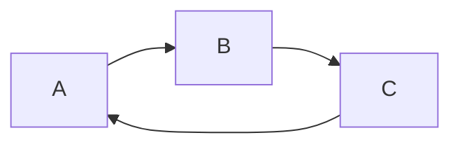
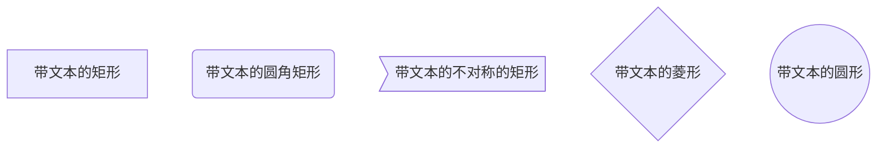
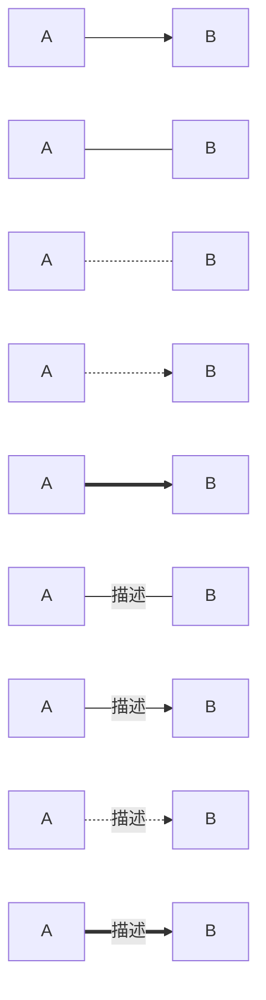
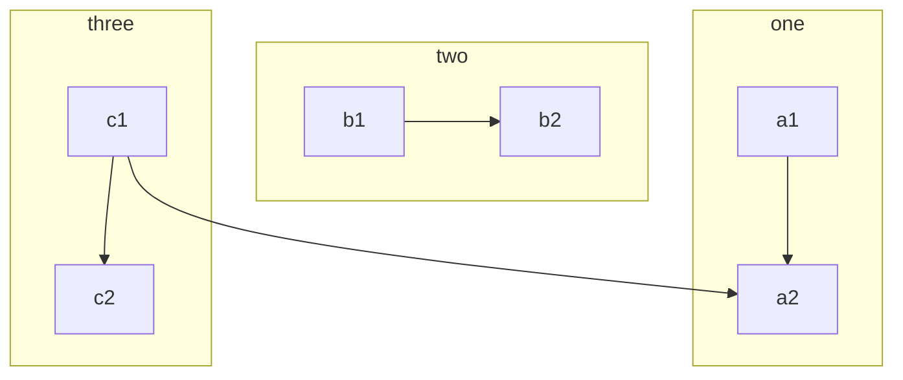
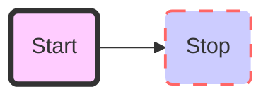

<!-- @import "[TOC]" {cmd="toc" depthFrom=1 depthTo=6 orderedList=false} -->

<!-- code_chunk_output -->

- [1.Flow](#1flow)
- [2.Sequence Diagrams](#2sequence-diagrams)
- [3.Mermaid](#3mermaid)
  - [1.常规](#1常规)
  - [2.基本图形](#2基本图形)
  - [3.节点之间的连接](#3节点之间的连接)
  - [4.子流程图](#4子流程图)
  - [5.自定义样式](#5自定义样式)

<!-- /code_chunk_output -->

###1.Flow

```flow
st=>start: Start:> http://www.baidu.com [blank]
e=>end: END:> http://www.baidu.com
op=>operation: Your operation
cond=>condition: Yes or No ?
s1=>subroutine: mysub
io=>inputoutput: do something|tag

st->op->cond
cond(yes)->io->e
cond(no)->s1->op
```

###2.Sequence Diagrams
支持两个主题 simple（默认主题）和 hand。

```sequence  {theme="hand"}
Andrew->China: Say hello
Note right of China: China thinks \nabout it
China-->Andrew: how are you
Andrew->>China: I am good thanks
```

###3.Mermaid
####1.常规
TB 从上到下
BT 从下到上
RL 从右到左
LR 从左到右


####2.基本图形
id + [文字描述]矩形
id + (文字描述)圆角矩形
id + >文字描述]不对称的矩形
id + {文字描述}菱形
id + ((文字描述))圆形


####3.节点之间的连接
A --> B A带箭头指向B
A --- B A不带箭头指向B
A -.- B A用虚线指向B
A -.-> B A用带箭头的虚线指向B
A ==> B A用加粗的箭头指向B
A -- 描述 --- B A不带箭头指向B并在中间加上文字描述
A -- 描述 --> B A带箭头指向B并在中间加上文字描述
A -. 描述 .-> B A用带箭头的虚线指向B并在中间加上文字描述
A == 描述 ==> B A用加粗的箭头指向B并在中间加上文字描述



####4.子流程图
subgraph title
    graph definition
end



####5.自定义样式


